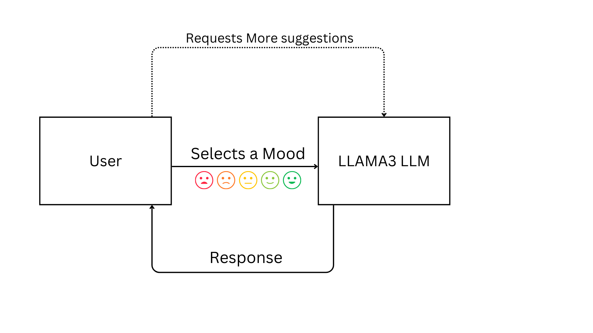

# 🤖 Multi Agent Student Assistant
Developed a system to process student queries and classify them into one or more categories: **scheduler**, **wellness**, **diet**, **and note maker**. Based on the classification, the system generates a tailored prompt for each category. If a query falls into multiple categories, the system creates separate prompts for each relevant category and sends them to the respective agents. Each agent processes its prompt and returns an output. The system then aggregates these outputs into a single, comprehensive response, ensuring the student receives all necessary information and tasks are completed efficiently in one go.

# Agent Processing
## 📅 Scheduler Agent
  Handles calendar-related queries.
  Interacts directly with the Google Calendar API to manage events and schedules.
  Focuses on efficient API interactions without using RAG (Retrieval-Augmented Generation).
  
## 📓 Note Maker Agent
  Manages study notes and creates study materials.
  Uses RAG for generating quizzes, flashcards, and mindmaps ensuring contextually relevant content.
  Interacts with a dedicated note storage system for basic note management.
  Here is the RAG pipeline used in this app:

  

## 🏋️‍♂️ Fitness Agent
  This agent assists in developing personalized fitness plans tailored to your specific goals. By completing a straightforward questionnaire, users can receive expert guidance in planning, deciding, and adhering to their customized fitness regimen.
  Potential future integration with external fitness tracking APIs.

  Here is the flowchart of this agent's working:

  
  
## 😊 Mood Agent
  This Agent provides comprehensive emotional support and mood management, offering empathetic responses,  and personalized coping strategies. Users can log their current moods, and receive tailored recommendations such as breathing exercises, mindfulness practices, and physical activities. By analyzing mood data, the Mood Agent helps users understand their emotional health and offers simple actionable advice to instantly uplift their moods and help maintain a balanced and positive mindset that in turn, boosts productivity! 
  
  Here is the flow of this agent: 
  


# Running the application 
Follow these steps to run the application:

1. **Clone the Repository**
   ```
   git clone https://github.com/jaz404/llama3hackathon.git
   ```
2. **Install Dependencies**
   ```
   pip install -r requirements.txt
   ```
3. **Run the Application**
   ```
   streamlit run app.py
   ```
4. **Access the Application**<br />
  Open your web browser and navigate to the address provided by Streamlit usually ```http://localhost:8501```
